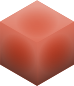
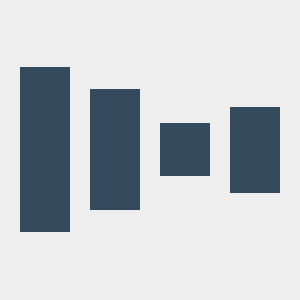

<h2 align="center">
    
    <p>Somaria</p>
</h2>
<p align="center">Model-driven data visualization</p>
<p align="center">
    [](https://travis-ci.org/pegasystems/somaria)
    [](https://codecov.io/gh/pegasystems/somaria)
</p>

### Introduction

Somaria draws shapes in WebGL based on a JSON object describing how data influences those shapes.    This data is composed of "blocks" which interconnect so that data flows through calculations and into shapes.

```javascript
// Your data visualization, described in JSON
var dataVizJSON = {
    drawables: [ "Drawable Iterator 1" ],
    blocks: [
        { // These "Published inputs" are configurable at runtime
            id: "Published inputs", type: "PublishedInputs",
            publishedOutputs: [
                {
                    id: "Values",
                    accessType: "External",
                    type: "list",
                    fallbackAccessType: "Value",
                    value: []
                }
            ]
        },
        {
            id: "Count 1", type: "Count",
            inputs: [
                { accessType: "Published", blockId: "Published inputs", reference: "Values" }
            ]
        },
        { // Iterators repeat drawables and actions
            id: "Drawable Iterator 1", type: "IteratorDrawable",
            drawables: [ "Rectangle 1" ],
            inputs: [
                { accessType: "Value" },
                { accessType: "Indexed", blockId: "Count 1", index: 0 }
            ],
            blocks: [
                { id: "Iterator variables", type: "IteratorVariables" },
                {
                    id: "Published inputs", type: "PublishedInputs",
                    publishedOutputs: [
                        { id: "Values", accessType: "Published", blockId: "Published inputs", reference: "Values" }
                    ]
                },
                {
                    id: "Convert range 1", type: "ConvertRange",
                    inputs: [
                        { accessType: "Indexed", blockId: "Iterator variables", index: 1 },
                        { accessType: "Value", value: 0 },
                        { accessType: "Indexed", blockId: "Iterator variables", index: 0 },
                        { accessType: "Value", value: -130 },
                        { accessType: "Value", value: 150 }
                    ]
                },
                {
                    id: "Lookup by index 1", type: "LookupIndexed",
                    inputs: [
                        { accessType: "Published", blockId: "Published inputs", reference: "Values" },
                        { accessType: "Indexed", blockId: "Iterator variables", index: 1 }
                    ]
                },
                {
                    id: "Point 1", type: "Point",
                    inputs: [
                        { accessType: "Indexed", blockId: "Convert range 1", index: 0 },
                        { accessType: "Value", value: 0 },
                        { accessType: "Value", value: 0 }
                    ]
                },
                {
                    id: "Rectangle 1", type: "Rectangle",
                    inputs: [
                        { accessType: "Value" },
                        { accessType: "Indexed", blockId: "Point 1", index: 0 },
                        { accessType: "Value", value: 50 },
                        { accessType: "Indexed", blockId: "Lookup by index 1", index: 0 },
                        { accessType: "Value" },
                        { accessType: "Value" },
                        { accessType: "Value", value: "center" },
                        { accessType: "Value", value: "min" }
                    ]
                }
            ]
        }
    ]
};

// Configure the visualization
var dataVizOptions = {
    height: 300,
    width: 300,
    backgroundColor: 0xEEEEEE,
    meshColor: 0x34495E
};

// The HTML5 canvas element to draw on
var canvas = document.createElement( "canvas" );

// Tell Somaria about our visualization
var dataViz = new Visualization( dataVizOptions, dataVizJSON, canvas );

// Tell Somaria about our data
dataViz.setInputValue( "Values", [ 165, 121, 53, 86 ] );

// Draw on the canvas using WebGL 🎉
dataViz.render();
```



The above example is basic and bland, but much more is possible!    Shape, color, positioning, mouse interaction, and animation can all be data-driven using Somaria's library of blocks.

### Compiling from Typescript

Be sure to install dependencies by running `npm install`.

The Typescript source code can be compiled using `npm run build`.    A combined ES5 source file will be generated at `build/Visualization.js` while CommonJS modules using ES6 will be generated under `spec/build` for testing purposes.

### Making changes

When making changes be sure to add or update unit tests under `spec/automated` and run them with `npm test`, then check coverage with `npm run coverage`.    Manual test fixtures are also available for inspection under `spec/manual`.    Finally, `npm run lint` will automatically adjust code style for consistency.
